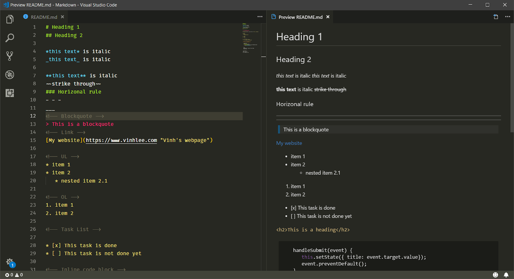
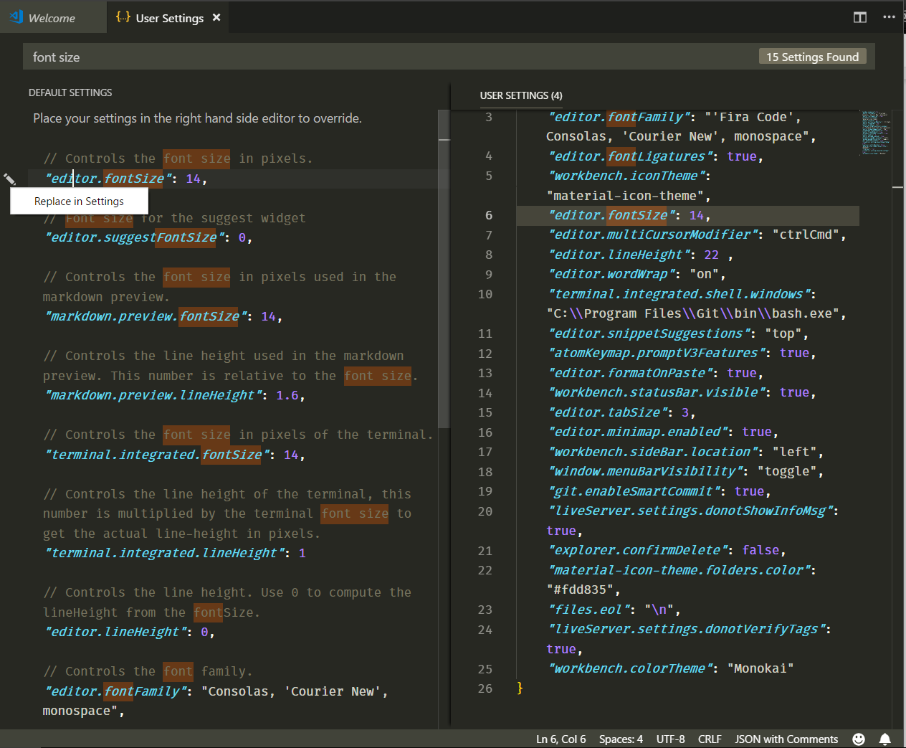
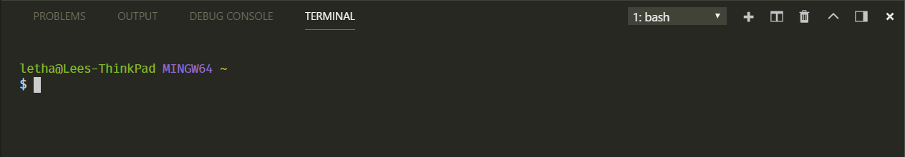
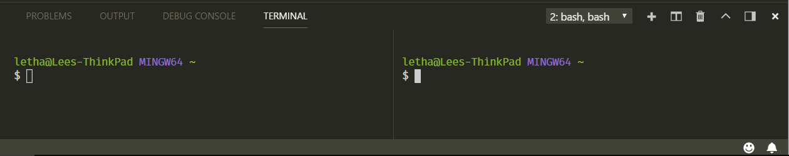
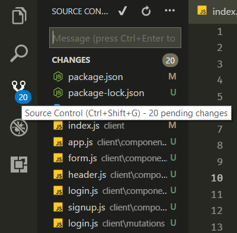
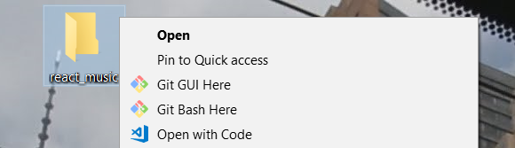
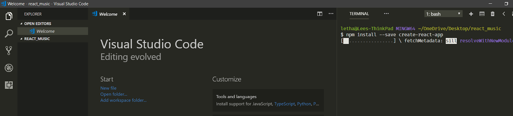
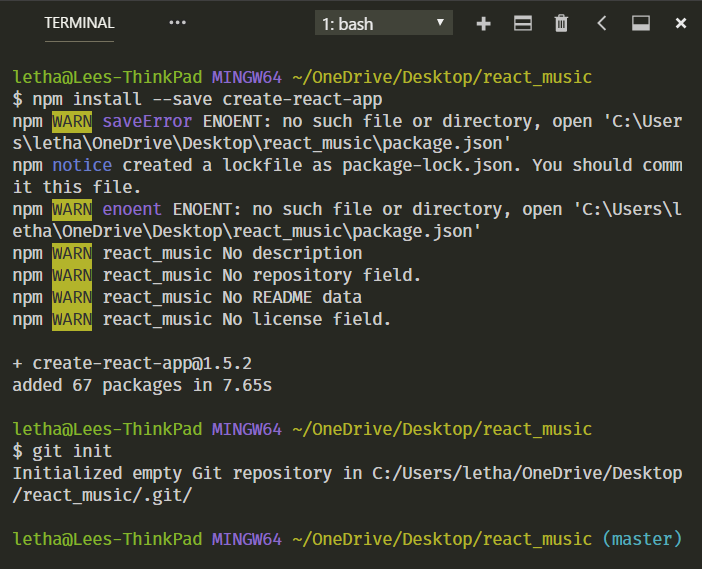

No matter whether you are a code newbie or a seasoned developer, code editor is an imperative part of your work. The problem, especially if you are a beginner, is that there are tons of choices for IDEs. And many of them share similar features, functionalities, and even UI. As a result, choosing the right IDE might actually take more time and effort that you thought.

If your question right now is: “which code editor should I start with?” then I would reply: “It depends, my friend.” Choosing a particular IDE significantly depends on a few factors: what type of developer you are, what kinds of environments you mostly work with, or whether you have an exclusive built-in feature that you absolutely need to get jobs done.

I would say that the way to choose one is to try and explore them all, and then pick what suits you best.

## Chosing the right editor for you
As most newbies do, I started with Notepad++ as my first code editor. This is perhaps one of the simplest IDEs that I’ve tried. Later on, as my needs started to require more advanced functionality from the editor, I tried out Brackets, Atom, then Visual Studio Code.

After a decent amount of experimenting, VSCode became my favorite. It impressed me with its modern UI, a wide availability of extensions, as well as great features such as built-in Git and terminal.

The main purpose of this blog is not to compare different IDEs, but to discuss my experience with VSCode. So in this post, I will:

* Show a brief introduction to VSCode
* Introduce the particular theme I’ve installed
* Discuss helpful extensions I use
* Show you how I leverage VSCode’s features to enhance my workflow.
 
Let’s get into it!

## But first, what is VSCode anyway?
Visual Studio Code (VSCode) is a source code editor developed by Microsoft that can be run on Windows, macOS, and Linux. It is free, open-source, and provides support for debugging as well as built-in Git version control, syntax highlights, snippets, and so on. The UI of VSCode is highly customizable, as users can switch to different themes, keyboard shortcuts, and preferences.

VSCode was originally announced in 2015 as an open-source project hosted on GitHub before releasing to the web a year later. Since then, Microsoft’s code editor has been gaining popularity among developers.

In the Stack Overflow 2018 Developer Survey, VSCode was ranked as the most popular development environment with around 35% out of over 100,000 respondents saying they use it. More stunningly, this figure is around 39% in the web development field.

And with monthly updates, users can expect to enjoy an even better experience — bug fixes, stability, and performance boosts are frequently pushed.

#Theme: Color and Font
If you’re like me, and you care about theme of your IDE, finding an appropriate font and theme color is very important. I personally prefer a dark theme and hate the default Consolas font of VSCode on Windows.

So the Monokai color theme and FiraCode font are my current choices. This combination brings a high contrast which I find very pleasant to work with.

* To install a theme, click Setting icon => Color Theme => Choose the theme that you like
* Find installation guideline of FiraCode here.
* You can also check out <strong>OneDarkPro</strong>, another great dark theme: in Extensions (Ctrl + Shift + X on Windows), search for OneDarkPro, click Install, and select it from the Color Theme.

## Useful extensions (Extensions => Search => Install)
These are some of my favorite extensions:

* <strong>Beautify</strong>: Beautify code in place and make your code more readable
* <strong>Bracket Pair Colorizer</strong>: allows matching brackets to be identified with colours
* <strong>ESLint</strong>: a must-have extension for React or JavaScript developers in general. ESLint is used to find problems and typos within your code, and allows you to mark that typo. It also suggests solutions.
* <strong>HTML Snippets</strong>: add rich language support for the HTML Markup such as auto-close tags.
* <strong>Live Server</strong>: launch a local server with live reload features for your HTML or PHP site
* <strong>Markdown Preview Enhanced</strong>: run live server for your markdown file.
* <strong>Material Icon Theme</strong>: provides icons based on Google’s Material Design. To activate, click Setting => File Icon Theme => Select Material Icon Theme
* <strong>Prettier</strong>: beautifully format your JavaScript/ TypeScript/ CSS code.

## Customize your UI

You can customize almost everything, from font-family and font-size of your code to line-height, by:
* Going to User Settings (Ctrl + ,)
* Searching for keywords related to your desired customization
* Clicking the Edit button on the left side of the settings and choosing Replace in Settings
* Changing the value of the setting that you just chose.

In my current setup, I set the fontSize to 14, lineHeight to 22, and tabSize to 3 for my personal preference (and for good readability).

## Things I wish I’d known since the beginning
Apart from these themes and extensions, I would like to share with you how I use VSCode’s great features to boost productivity. These are all things that I didn’t know as a beginner, and that would’ve been very helpful for leveraging and facilitating my workflow.

### Integrated Terminals
It is kind of inevitable that the more time you are in software development, the more important the Terminal becomes. As a JavaScript developer, I use the Terminal to install packages, run the development server, or even push changes in my current repository to GitHub.

In the beginning, I mostly took care of those tasks with Windows Command Prompt or Git Bash later on. If you use Windows, then you may know how dumb and annoying CMD can be. Git Bash is a nice tool, but switching between apps when you are working is not really a pleasant experience.

VSCode truly solves this problem for me with its fantastic terminal. And the cool thing is you can easily set it up to work the same way as Git Bash, but right inside VSCode! You then have an awesome combination.

To access the VSCode terminal, use <strong>Ctrl + `</strong> (left side of your 1 key). Then the Terminal will pop up.

From here, you can do tons of cool things like create a new terminal or kill the existing one. You can also split-view as well as side-view them.

### Version control (Git)

When you are working on a repository and constantly need to make changes, you would normally find the terminal to commit recent changes, wouldn’t you? Well, VSCode gives you an awesome built-in tool to control your versions.

By clicking the Git icon located in the left panel or using Ctrl + Shift + G (Windows), you have easy access to Source Control. In here, you can do all the Git thingies. So convenient, isn’t it?

## How do all these things enhance my workflow — and how can they make yours better, too?
After a decent amount of time working with VSCode, I strongly believe its key value is based in its all-in-one environment. All of my needs and tasks within my workflow as a Front-end developer is nicely and flawlessly handled.

To make these advantages clearer, let me walk you through my normal workflow.

Let’s say I got some ideas working on a new Music app created by React. I normally start a project by creating a blank folder — so I’ll create a new folder named music_react. After that, I can immediately open the project in VSCode by choosing a right-click option.

Once I am in my working project, I can quickly create the file and folders with shortcuts in the left panel.

In this project, I want to use the create-react-app initialization. Therefore, I may need to install that package — not a big deal. I open my terminal by typing Ctrl + `. Amazingly, the terminal automatically navigates to my exact directory. There is no need to change directories anymore.

After entering in the command line to install the npm package, all I need to do is to wait until all dependencies are installed.

I also want to publish my project on GitHub, so I should probably initialize a Git repository at first. After the packages are installed, I type a Git initialization command right in my terminal as well.

Once Git is successfully installed, I can commit all pending changes right in the Source Control on the left panel.

Then I can continue to work on my project as normal. Besides, I can push all changes to GitHub from my terminal if I want to.

## Wrapping up
So that’s my normal workflow in the VSCode environment. I understand that this varies significantly depending on what type of developer you are. A back-end developer might have a completely different workflow compared to mine.

However, if you are a front-end developer who is just getting to know VSCode, and you want to check it out before getting into it, I hope that this article gives you insight and helps enhance your productivity. After all, my biggest inspiration to write this small guideline is because I could not really find any thorough review of VSCode for newcomers. As a result, this blog hopefully can bring you some value.